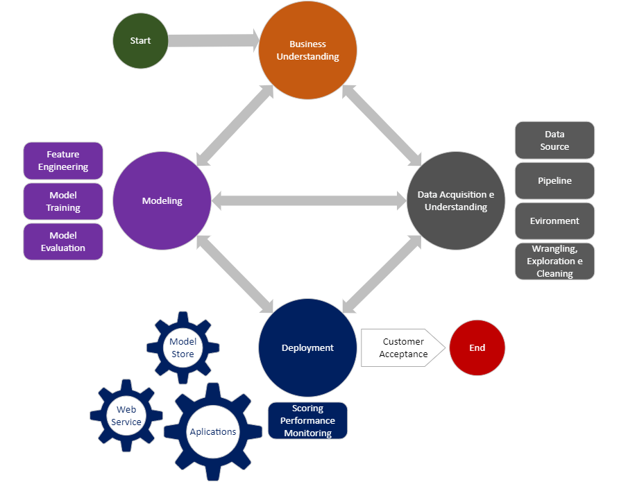
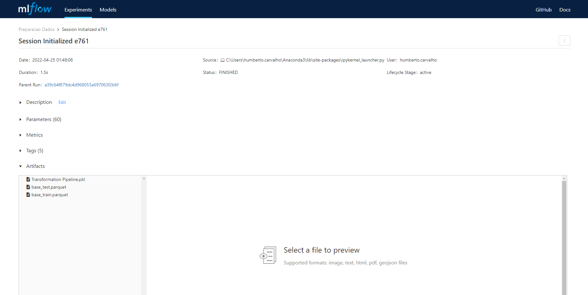
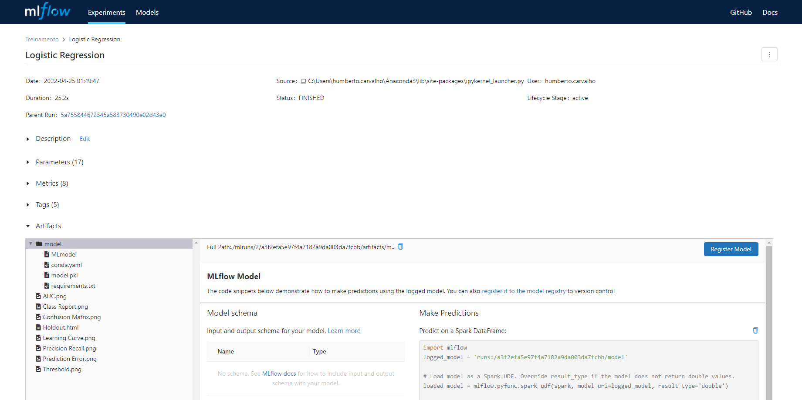
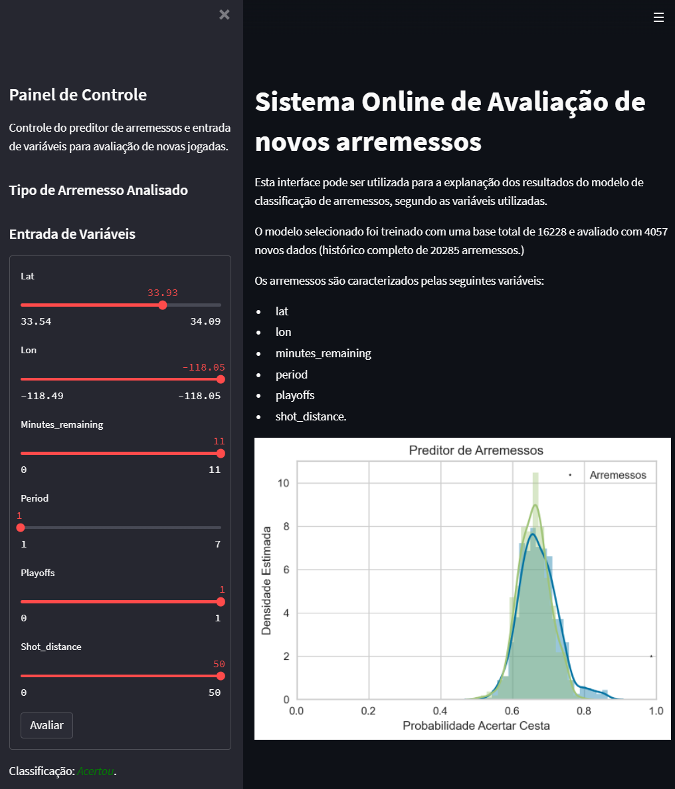

# 1 - Modelo

# 2 - Diagrama

# 3 - importância de implementar pipelines

Os pipelines são responsáveis por padronizar, otimizar e melhorar o tratamento dos dados. A separação de desenvolvimento e produção se faz necessário devido a necessidade de tratamento e entendimento do problema na fase de experimentação, e posteriormente o deploy com o melhor ajuste do modelo da fase de treinamento.

# 4 - Como as ferramentas Streamlit, MLFlow, PyCaret e Scikit-Learn auxiliam na construção dos pipelines?

1.  Rastreamento de experimentos;
    1.  Utilizando o MLFlow na fase de experimentação é possível rastrear todos os testes e eventos utilizados, além das versões adotadas em cada configuração, em quaisquer fases da modelagem, seja aquisição dos dados, preparação dos dados ou treinamento do modelo.
2.  Funções de treinamento;
    1.  As bibliotecas PyCaret e Scikit-Learn, possibilitam o desenvolvimento acelerado e facilitado dos modelos de Machine Learning, bem como o monitoramento e verificação da qualidade do mesmo.
3.  Monitoramento da saúde do modelo;
    1.  É possível de forma simplificada utilizar gráficos, com as mais variadas métricas, no Streamlit viabilizando a verificação do desempenho do modelo.
4.  Atualização de modelo;
    1.  O retreinamento do modelo é feito de forma rápida e simples por meio das bibliotecas: MLFlow, Pycaret e Scikit-Learn.
5.  Provisionamento (Deployment).
    1.  Tanto MLFlow, quanto Streamlit, nos oferece alternativas interessantes para a etapa de aplicação. Podendo servir o modelo por endpoint ao usuário final.

# 5 - Com base no diagrama realizado na questão 2, aponte os artefatos que serão criados ao longo de um projeto. Para cada artefato, indique qual seu objetivo.

1.  Requisição de Dados: obtenção dos registros necessários para todas as etapas do projeto de Machine Learning.
2.  Processamento dos dados: fase que tem por objetivo o tratamento dos dados para que haja melhor desempenho do modelo.
3.  Treinamento do Modelo: onde é feita a aprendizagem da máquina, e possibilitará o modelo decidir a resposta de acordo com os dados de entrada.
4.  Hyperparâmetros e processo de tunagem: tem como propósito a melhoria do modelo
5.  Deploy do modelo: Disponibilização da aplicação para o usuário final
6.  Monitoramento do modelo: etapa que tem como finalidade a verificação da saúde e desempenho do modelo.

# 6- Implemente o pipeline de processamento de dados com o mlflow, rodada (run) com o nome "PreparacaoDados":

# 7 - Implementar o pipeline de treinamento do modelo com o Mlflow usando o nome "Treinamento"

# 8 - Registre o modelo de classificação e o disponibilize através do MLFlow através de API. Selecione agora os dados da base de dados original onde shot\_type for igual à 3PT Field Goal (será uma nova base de dados) e através da biblioteca requests, aplique o modelo treinado. Publique uma tabela com os resultados obtidos e indique o novo log loss e f1\_score.

1.  O modelo não é aderente a nova base de acordo com as metricas de f1\_score e log\_loss, que ficaram abaixo do necessário. O desacordo é justificado pelo fato da base de treino estar muito diferente dos dados de operação.
2.  Monitoramento da saúde do modelo:
    1.  **Com a disponibilidade de resposta**: Neste cenário seria possível pela monitoramento das métricas, no comparativo entre o valor predito e o valor real. Estabelecendo um threshold de desempenho.
    2.  **Sem a disponibilidade de resposta**: Uma das possibilidades seria utilizar um range de tempo.
3.  Retreinamento.
    1.  **Reativo**: Implementar um gatilho utilizando as métricas.
    2.  **Preditivo**: Gerar um modelo, para verificação de tempo adequado, para novo treinamento. Ou de forma simplificada definir um range de tempo para retreino.

# 9 - Implemente um dashboard de monitoramento da operação usando Streamlit.

